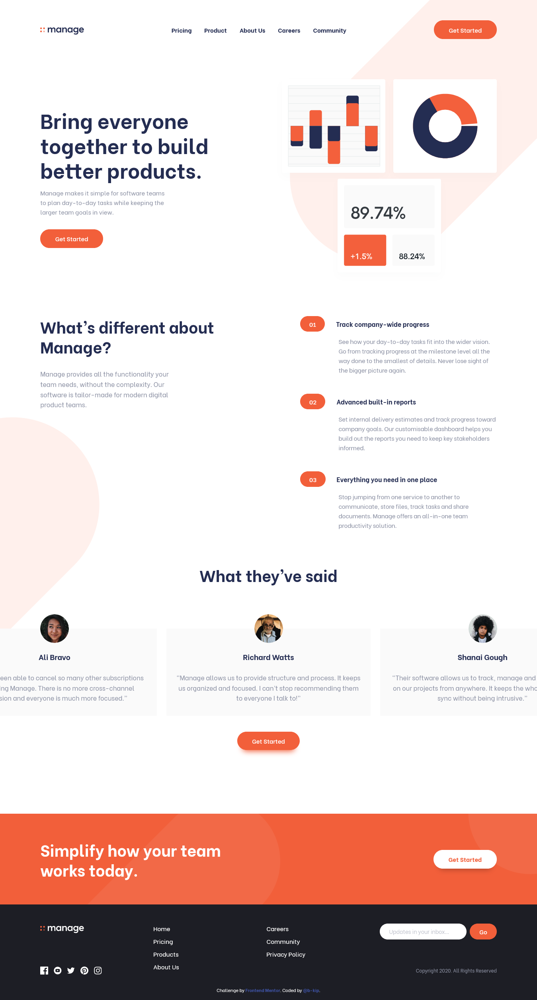

# Manage landing page
The landing page for **Manage** whose mission is to make it easy for software teams to track daily tasks and achieve team goals.

This implementation of the Manage landing page that was designed and offered as a [Frontend Mentor](https://www.frontendmentor.io/challenges/manage-landing-page-SLXqC6P5) challenge. Frontend Mentor challenges help you improve your coding skills by building realistic projects. 

## Overview
## The challenge requirements

The Frontend Mentor challenge requirements were to ensure that the user should be able to:

- View the optimal layout for the site depending on their device's screen size
- See hover states for all interactive elements on the page
- See all testimonials in a horizontal slider
- Receive an error message when the newsletter sign up `form` is submitted if:
  - The `input` field is empty
  - The email address is not formatted correctly

### Screenshot

### Links

- [View solution code](https://github.com/b-kip/manage-landing-page-master)
- [View live site](https://manage-ecru.vercel.app/)
## My process

### Built with

- Semantic HTML5 markup
- CSS custom properties
- Flexbox
- CSS Grid
- Mobile-first workflow
- Sass
- ES6
- Parcel Bundler
- [Glide.js](https://glidejs.com/)

### What I learned

  - Validating forms using the [Constraint Validation API](https://developer.mozilla.org/en-US/docs/Learn/Forms/Form_validation#the_constraint_validation_api).
  - Responsively positioning background images on a page.
    `background-position: calc(50% + 55vw) top;`
  - Creating a horizontal slider using [glidejs](https://glidejs.com/).

### Continued development

  - Converting this landing page to a React/Angular application.

### Useful resource

  - MDN: [Constraint Validation API](https://developer.mozilla.org/en-US/docs/Learn/Forms/Form_validation#the_constraint_validation_api).

## Author

[b-kip](https://github.com/b-kip)

## Acknowledgments

Referenced ksenia's work from https://github.com/ksenius on positioning background images.